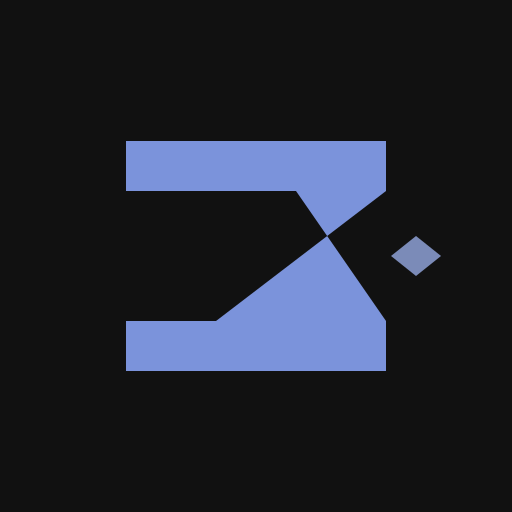

<p align="center">
  
</p>

<h1 align="center">zphp</h1>

<p align="center">A PHP runtime. Single binary.</p>

---

zphp is a from-scratch PHP runtime with broad PHP 8.x compatibility. It ships as a single binary with a built-in HTTP server, WebSocket support, TLS, HTTP/2, and database drivers for SQLite, MySQL, and PostgreSQL.

```sh
zphp run app.php                    # run a script
zphp serve app.php --port 8080      # start an HTTP server
zphp build --compile app.php        # compile to a standalone executable
zphp test                           # run tests
zphp fmt src/*.php                  # format code
zphp install                        # install packages from composer.json
```

## Quick comparison

| | Traditional PHP | zphp |
|---|---|---|
| Run a script | `php script.php` | `zphp run script.php` |
| HTTP server | php-fpm + nginx | `zphp serve app.php` |
| Install deps | `composer install` | `zphp install` |
| Add a package | `composer require pkg` | `zphp add pkg` |
| Run tests | `phpunit` | `zphp test` |
| Format code | `php-cs-fixer fix` | `zphp fmt` |
| Standalone binary | - | `zphp build --compile app.php` |

## Use cases

**CLI tools as single binaries** - write a data migration script, a log parser, a CI/CD utility in PHP. Compile it with `zphp build --compile`. Distribute one file. No "install PHP" step for the person running it.

**Edge and embedded** - the full runtime with HTTP, WebSocket, and SQLite in under 8MB. Runs on a Raspberry Pi, a $5 VPS, a minimal container.

**Microservices** - one process, one port, one file. `zphp serve` with worker pooling and pre-compiled bytecode. Standalone binaries make container images trivial - `FROM scratch`, `COPY`, `ENTRYPOINT`.

**WebSocket servers** - native WebSocket support with persistent connection state. No Redis for session data, no polling workarounds. Define `ws_onOpen`, `ws_onMessage`, `ws_onClose` and you have a real-time server.

**Prototyping** - zero-install PHP. Download one binary, write code, run it. Formatter, test runner, and package manager included.

## Installation

Download prebuilt binaries from [GitHub Releases](https://github.com/nvms/zphp/releases). See the [documentation](https://nvms.github.io/zphp/) for building from source and detailed guides.

---

This project is an experiment in AI-maintained open source - autonomously built, tested, and refined by AI with human oversight. Regular audits, thorough test coverage, continuous refinement. The emphasis is on high quality, rigorously tested, production-grade code.
